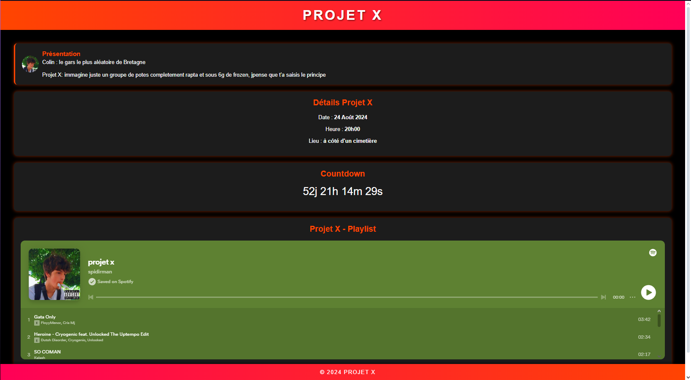

# Projet X Colin

Ce projet est un site web pour présenter l'événement "Projet X" avec Colin, prévu pour le 24 Août 2024 à 20h00. Le site inclut des détails sur l'événement, une playlist Spotify, et un compte à rebours.

## Aperçu

## Fonctionnalités

- **Header :** Affiche le titre principal "Projet X".
- **Section Présentation :** Présente Colin et la nature de l'événement.
- **Section Détails :** Informations sur la date, l'heure et le lieu de l'événement.
- **Countdown :** Compte à rebours jusqu'au début de l'événement.
- **Playlist :** Intégration d'une playlist Spotify.
- **Footer :** Mentions légales et droits d'auteur.

## Technologies Utilisées

- HTML
- CSS (styles personnalisés)
- JavaScript (pour le compte à rebours)

## Liens Utiles

- [Accéder au site en ligne](https://projet-x-colin.vercel.app)
- [Voir le code source sur GitHub](https://github.com/spidirman/projet-x)

## Comment Contribuer

Si vous souhaitez contribuer à l'amélioration du site, vous pouvez :

1. Cloner le dépôt GitHub : `git clone https://github.com/spidirman/projet-x.git`
2. Créer une nouvelle branche : `git checkout -b ameliorations`
3. Faire vos modifications et les valider : `git commit -am 'Ajouté une fonctionnalité XYZ'`
4. Pousser les changements sur la branche : `git push origin ameliorations`
5. Soumettre une demande d'extraction sur GitHub

## Licence

© 2024 Projet X. Ce projet est sous licence MIT. Voir le fichier `LICENSE` pour plus de détails.
